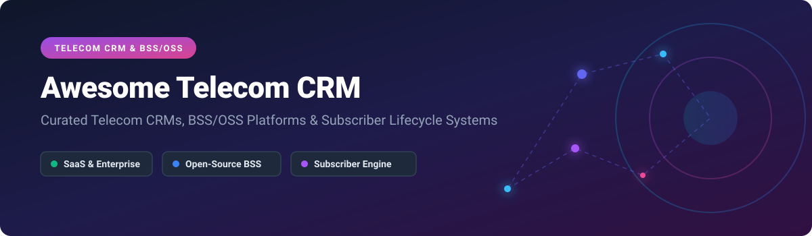

  

# 📡 Awesome Telecom CRM

  
  
  
  
  
  

## 🚀 Top Telecom CRM & BSS/OSS Ecosystem

**Curated List of Telecom CRM SaaS Products, BSS/OSS Platforms & Open-Source Repositories**  

*Focused on Subscriber Lifecycle Management, TM Forum Open APIs, Billing Systems, ISP Provisioning & Self-Hosted Telecom CRM Solutions.*  

**Last updated: October 2026** 📅

---

### 🔍 Search Engine Optimization (SEO) & Key Overview
Welcome to the definitive directory for **Telecom Customer Relationship Management (CRM)**, **Business Support Systems (BSS)**, and **Operations Support Systems (OSS)** software. Whether you are an incumbent Telecommunications Service Provider (CSP), Mobile Virtual Network Operator (MVNO), Internet Service Provider (ISP), or VoIP carrier, this guide connects you to top commercial enterprise platforms and cutting-edge open-source repositories.

Keywords & Focus Areas: `Telecom CRM`, `BSS/OSS Integration`, `Subscriber Management System`, `TM Forum Open APIs`, `Carrier Billing`, `DOCSIS / FTTH Provisioning`, `VoIP Softswitch Billing`, `SIM Inventory Management`, `Agile Telecom BSS`.

---

## 📋 Table of Contents
- [🏢 SaaS & Commercial Platforms](#-saas--commercial-platforms)
- [🔓 Open-Source GitHub Projects](#-open-source-github-projects)
  - [⚡ High-Impact Telecommunications & BSS Projects](#-high-impact-telecommunications--bss-projects)
  - [🛠️ Open-Source Subscriber Management & Billing Systems](#%EF%B8%8F-open-source-subscriber-management--billing-systems)
  - [🌐 Additional Open-Source Options](#-additional-open-source-options)
- [💖 Support & Sponsorship](#-support--sponsorship)
- [🤝 How to Contribute](#-how-to-contribute)
- [⚠️ Disclaimer](#%EF%B8%8F-disclaimer)
- [📊 Star History](#-star-history)

---

## 🏢 SaaS & Commercial Platforms

> 💡 **Market Size & Structure Note**: The global Telecom CRM and BSS/OSS market size is estimated at **$75 Billion+ to $120 Billion+**, growing at a ~10-12% CAGR driven by 5G network rollouts, cloud migration, and IoT billing. The market is **moderately fragmented**: dominated at the hyper-scale enterprise layer by giants like Salesforce, Oracle, and Amdocs, but featuring competitive niches for specialized BSS/OSS suites (Cerillion, Subex, Hansen) across regional CSPs and MVNOs (not a pure winner-take-all market).

| Platform | Company Size (Revenue / Market Cap) | Starting Tier Pricing | Free Tier / Trial Limit | Description |
| :--- | :--- | :--- | :--- | :--- |
| **[Oracle Communications](https://www.oracle.com/communications/)** | ~$407B Market Cap / $67.36B Annual Revenue | $275/user/month (Enterprise Cloud Suites) | 30-day free trial on Oracle Cloud Free Tier | **Enterprise telecom software** — CRM, billing, and network solutions for CSPs. |
| **[Salesforce Communications Cloud](https://www.salesforce.com/)** | ~$280B Market Cap / $41.5B Annual Revenue | $275/user/month | 30-day free trial | **Salesforce's telecom industry CRM** — subscriber management, order capture, and service assurance built on the Salesforce platform. **Best for telecom operators already in the Salesforce ecosystem**. |
| **[Ericsson Telecom CRM](https://www.ericsson.com/)** | ~$30.5B Market Cap / ~SEK 236.7B Annual Revenue | Enterprise custom quote (Contact Sales) | Interactive Sandbox Demo upon request (No standalone free trial) | **Ericsson's telecom CRM** — subscriber management and customer care for mobile operators. |
| **[Amdocs CRM](https://www.amdocs.com/)** | ~$10B Market Cap / $4.53B Annual Revenue | Enterprise custom quote (Contact Sales) | Guided product demo (No standalone free trial) | **Communications and media industry software** — CRM, billing, and operations for telecom and media providers. **The enterprise standard for telecom CRM**. |
| **[Netcracker CRM](https://www.netcracker.com/)** | ~$3.5B Estimated Valuation (Parent NEC $15B+ Revenue) | Enterprise custom quote (Contact Sales) | Proof of Concept / Demo upon request (No standalone free trial) | **Telecom BSS/OSS suite** — CRM, order management, and revenue management for communications service providers. |
| **[CSG Systems](https://www.csgi.com/)** | ~$2.3B Valuation / $1.22B Annual Revenue | Enterprise custom quote (Contact Sales) | Architectural Demo upon request (No standalone free trial) | **Telecom revenue management** — billing, CRM, and customer care for telecom operators. |
| **[Comarch CRM](https://www.comarch.com/)** | ~PLN 1.9B (~$490M USD) Annual Revenue | Enterprise custom quote (Contact Sales) | Live product demo upon request (No standalone free trial) | **Telecom CRM and BSS** — customer management, billing, and analytics for telecom operators. |
| **[Hansen Technologies](https://www.hansencx.com/)** | ~A$386.5M (~$260M USD) Annual Revenue | Package custom quote via Advanced Pricing Calculator | Interactive 1-on-1 walkthrough demo (No standalone free trial) | **Telecom billing and CRM** — customer care and revenue management for utilities and telecom. |
| **[Cerillion](https://www.cerillion.com/)** | ~$269M Market Cap / £45.4M Annual Revenue | $150/month (Cerillion Skyline Essential Edition) | 14-day free trial on Cerillion Skyline | **Telecom BSS/OSS suite** — CRM, billing, and convergent charging for CSPs. |
| **[Subex](https://www.subex.com/)** | ~₹1,088 Cr (~$130M USD) Market Cap / ₹279 Cr Annual Revenue | Enterprise custom quote (Contact Sales) | 1-on-1 feature demo upon request (No free version or trial) | **Telecom analytics and revenue assurance** — business optimization and risk management for CSPs. |

---

## 🔓 Open-Source GitHub Projects

Sorted strictly by GitHub Star Counts in descending order ⭐.

### ⚡ High-Impact Telecommunications & BSS Projects

- **[Asterisk](https://github.com/asterisk/asterisk)**   
  **The open-source communications toolkit** powers IP PBX systems, VoIP gateways, conference servers, and call centers worldwide. Provides telephony backend primitives for building custom telecom CRM integrations and interactive voice response (IVR) customer flows.

- **[Open5GS](https://github.com/open5gs/open5gs)**   
  **C-language Open Source 5G Core and EPC implementation** for 5G SA/NSA and 4G/LTE networks. Acts as the core network foundation for subscriber data management (HSS/UDM), session management (SMF), and subscriber authentication.

- **[Magma Core](https://github.com/magma/magma)**   
  **Open-source software platform for building converged wireless networks** (LTE/5G/WiFi). Integrates subscriber management and policy enforcement, allowing network operators to manage access and subscriber billing parameters.

### 🛠️ Open-Source Subscriber Management & Billing Systems

- **[Ubilling](https://github.com/nightflyza/Ubilling)**   
  **Free, open-source billing and automation system for Internet Service Providers (ISPs)**. Offers subscriber management, network monitoring, service accounting, and MikroTik equipment control. Over 15 years of market presence.

- **[NMS Prime OSS Provisioning](https://github.com/cablelabs/os-provisioning)**   
  **Modular CRM, BSS, and OSS platform for telcos and ISPs**. Delivers vendor-agnostic service activation and CPE management across DOCSIS, FTTH, FTTx, DSL, and WiFi networks with Laravel PHP 8.

- **[openCRX](https://github.com/opencrx/opencrx)**   
  **Enterprise-class open-source CRM suite** with telecommunications industry extensions. Java-based architecture supporting XML, HSQL, Oracle, MySQL, PostgreSQL, DB2, and SQL Server.

- **[HornBill ISP Billing Manager](https://github.com/mwakidenis/HornBill)**   
  **Multi-Tenant ISP Billing & Client Manager** tailored for Internet Service Providers managing subscription plans, user credentials, and bandwidth dunning.

- **[FreeSWITCH](https://github.com/signalwire/freeswitch)**   
  **Open-source multi-protocol softswitch** designed to route and interconnect audio, video, and text messages. Serves as the core voice engine for telecom customer call center CRM systems.

- **[ISP Mikrotik Billing System](https://github.com/CodePagol/ISP-Mikrotik-Billing)**   
  **Modern ISP billing and network management system for MikroTik RouterOS** featuring PPPoE/Hotspot provisioning, automated subscriber billing, and real-time monitoring.

- **[BSS-OSS Rust Ecosystem](https://github.com/rabbittrix/BSS-OSS-Rust-Ecosystem)**   
  **High-performance BSS/OSS foundation built in Rust**, fully compliant with **TM Forum Open APIs** (TMF678, TMF635, TMF668, TMF632, TMF669). Features real-time usage rating, subscription cycle management, and OAuth2/PKCE security.

- **[BillRun CRM](https://github.com/BillRun/CRM)**   
  **Open-source CRM built specifically for telecom operators**, based on SuiteCRM. Features OSS interface modules, subscriber management, SIM card/router inventory tracking, and number portability gateway integration.

- **[Discobole BSS](https://www.ow2.org/)**   
  **Cloud-native TM Forum-compliant BSS suite** deployed at Orange European and MEA subsidiaries. Supports full Order-to-Bill workflows for mobile and FTTH B2C offerings.

- **[ASTPP BSS/OCS](https://github.com/astpp)**   
  **Open-source VoIP billing & Online Charging System (OCS)** for telecom operators, ITSPs, MVNOs, and wholesale carriers with real-time prepaid balance rating.

### 🌐 Additional Open-Source Options

- **[Romashka Telecom](https://github.com/OlgaRhythm/romashka-telecom)**  — Microservices-based telecom CRM and billing system (Java 17, Spring Boot, RabbitMQ, PostgreSQL, Docker) demonstrating CDR generation, rating server, and salon manager CRM features.
- **[Telecom Subscriber Management System](https://github.com/Mrcaptain-00/python-sql-databse-project)**  — Python-MySQL subscriber management system inspired by TRAI regulatory standards with IMSI, MCC, and ICCID tracking.
- **[Telecom Management System SQL](https://github.com/MohamedAtef721/Telecom-Management-System-sql-Project)**  — End-to-end MS SQL database project for managing customers, SIM cards, subscriptions, ARPU metrics, and churn risk analytics.
- **[ICTCRM](https://github.com/ICTWORKFORCE/ictcrm)** — Unified communications integrated CRM built on SuiteCRM with ICTContact for voice, IVR, and messaging campaigns.
- **[SalesLinkCRM](https://github.com/saleslinkcrm/saleslinkcrm)** — Tailored CRM for residential and commercial telecom sales dealers with carrier qualification tools.

---

## 💖 Support & Sponsorship

If you find this repository valuable for your telecom engineering team, BSS architecture research, or open-source deployment, please consider supporting the project!

- ⭐ **Star this repository** to increase visibility on GitHub.
- 🔀 **Fork and share** with your telecom and ISP engineering network.
- ☕ **Buy a coffee / Sponsor**: Support ongoing maintenance on the [Sponsor Dashboard](https://github.com/sponsors/ishandutta2007).

---

## 🤝 How to Contribute

1. Fork this repository.
2. Add or update entries in `README.md` following the tabular or starred bullet list formats.
3. Include project name, official/GitHub URL, star count badge, and factual feature summary.
4. Open a Pull Request with a clear description of the addition.

---

## ⚠️ Disclaimer

- This list is **community-curated** for educational and architectural reference purposes only.
- Telecom CRM platforms process sensitive subscriber Personally Identifiable Information (PII) and CDR records subject to strict regulatory frameworks (GDPR, CPNI, telecom security standards). Self-hosted deployments require comprehensive security audits.
- Verify license compatibility (AGPL, GPL, Apache-2.0, MIT) before implementing in commercial production environments.

---

## 📊 Star History

---

**Made with ❤️ for telecom operators, ISPs, MVNOs, and open-source software enthusiasts worldwide.**
